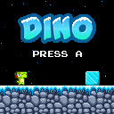

# Dino Game

This game is a remake for the ESPboy handheld of the famous [Dinosaur Game][chromedino] (also known as the Chrome Dino), a browser game developed by Google and built into the Google Chrome web browser. The player guides a pixelated Tyrannosaurus Rex across a side-scrolling landscape, avoiding obstacles to achieve a higher score. The game was created by members of the Chrome UX team in 2014.

**Dino** is a one button runner game: just press **[A]** button to jump and get the highest score possible.

This is a basic casual game, but it's mostly a project to provide you with a fairly complete example of how to make a game with the [ESPboy library][espboy].

The code also relies on the following libraries:

- [LovyanGFX][lovyangfx] for graphic display
- [ESPboy_Playtune][playtune] for sound effects
- [FixedPointsArduino][fixedpoint] to optimize some arithmetic calculations

The sound effects have been converted into a format suitable for ESPboy_Playtune library using [midi2tones][midi2tones], which is a very handy tool.

The cute dino sprite is a creation of [@ArksDigital][arksdigital].

I would like to thank the authors of these tools and assets which were very useful for this project.

## Quick installation on your ESPboy

You can easily install and test the Dino game on your ESPboy right away (without having to compile the project) using the [ESPboy Flasher][flasher]. This tool is only supported by Google Chrome and Microsoft Edge.

## Demo

[chromedino]:  chrome://dino
[espboy]:      https://m1cr0lab-espboy.github.io/ESPboy
[lovyangfx]:   https://github.com/lovyan03/LovyanGFX/
[fixedpoint]:  https://github.com/Pharap/FixedPointsArduino
[playtune]:    https://github.com/ESPboy-edu/ESPboy_Playtune
[midi2tones]:  https://github.com/MLXXXp/midi2tones
[arksdigital]: https://twitter.com/ArksDigital
[flasher]:     https://m1cr0lab-espboy.github.io/Dino/
